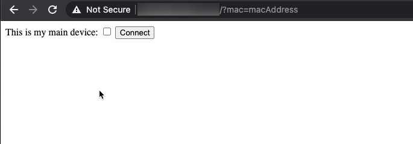

# Captive Portal for Guest Detection

This application is a node express app that serves a registration page to guests when they connect to the guest network hotspot. The intention is to capture the guest's device's MAC address (sent from the USG/router) and register it with Home Assistant. In doing so, the device can be used as a presence sensor and inform any automation if a guest is present.

## Prerequisite Setup

1. A Ubiquiti USG/router
1. Enable a guest network as a hotspot in the USG
1. Add the `$CLUSTER_IP` to the list of [pre-authorized access IPs](https://help.ui.com/hc/en-us/articles/115000166827-UniFi-Guest-Network-Guest-Portal-and-Hotspot-System) for the hotspot
1. Appropriate secrets setup for the USG; see [secrets catalog](../../docs/secrets-catalog.md) for more details.
1. Setup the [Unifi Home Assistant integration](https://www.home-assistant.io/integrations/unifi/)
1. Create a group in Home Assitant named `guests`; this is where registered guests devices will be assigned

## User Flow

1. User connects to the guest network with provided wpa2 password
1. User is directed to the captive portal application
1. User will fill out the form (checkbox if the connecting device is a phone) and click the Connect button
1. Connecting will authorize the User and grant access to the Internet on the guest network.
1. If indicating that the device is a phone, then the device is looked up in Home Assistant by its MAC address
   - device should be in Home Assistant via the Unifi integration automatically
1. The Home Assistant entity for the device (by its MAC address) is added to the `guests` group in Home Assistant
1. `group.guests` is either `home` or `not_home` based on its members' state
   - When the guest device disconnects from the network, then they are considered `not_home`
   - When reconnecting, they are considered `home`

## Example Image of Captive Portal

## Developing Locally

> See the [testing applications locally guide](../../docs/testing-apps-locally.md) for more details.

1. Ensure you have a working cluster running (follow the [brand new installation guide](../../README.md))
1. `./start-captive-portal-locally.sh`
1. Visit `http://localhost:8081?mac=123` to view the site.
