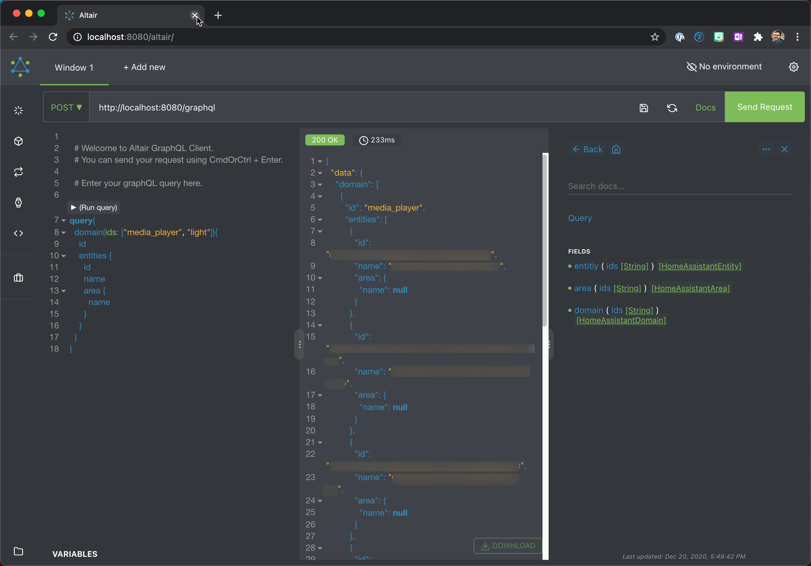

# GraphQL API

This app provides a single interface to interact with the home automation system services. It provides a GraphQL endpoint that enables other services to query or mutate the home automation graph. The intention is for other services to use a single API instead of taking direct dependencies on several other services.

## Running Locally

> See the [testing applications locally guide](../../docs/testing-apps-locally.md) for more details.

1. Ensure you have a working cluster running (follow the [brand new installation guide](../../README.md))
1. `yarn start --scope @ha/graphql-api-app`
1. Visit `http://localhost:8080/altair` for an interactive GraphQL client
   - Ensure you set the Authorization header in the client with your `$GRAPHQL_API_TOKEN`; e.g. `Authorization: Bearer $GRAPHQL_API_TOKEN`

